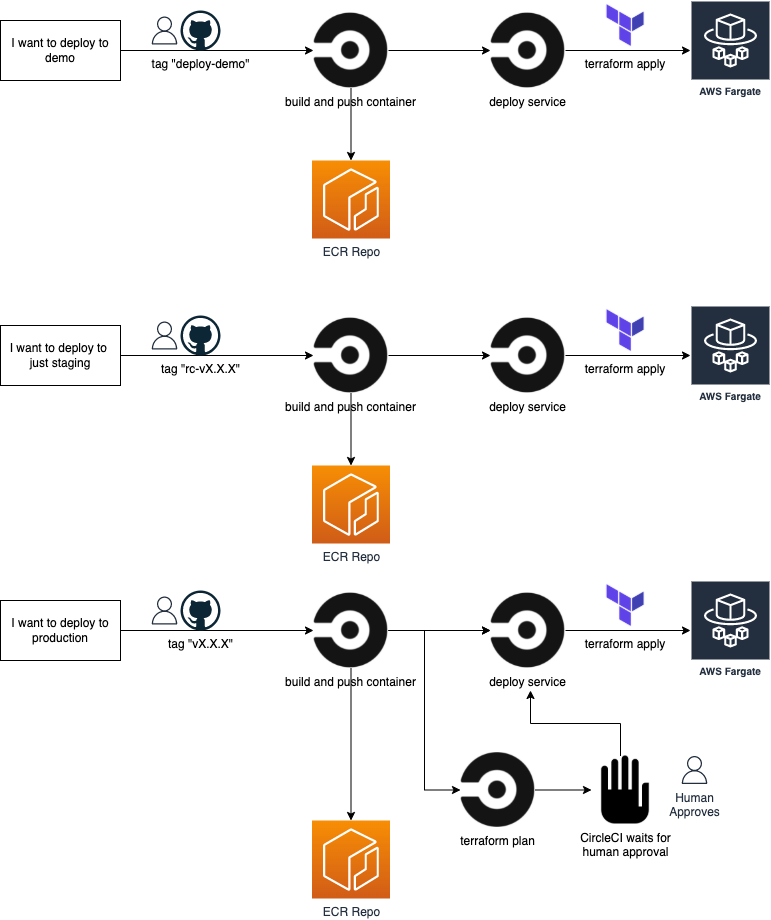

# HUBZone API

This application houses the custom HUBZone Geo API for the Small Business Administration.

### Table of Contents
- [Local Development](#local-development)
  - [Software](#software)
  - [Building](#building)
  - [Launch Locally](#launch-locally)
- [API Specification](#api-specification)
- [Testing](#testing)
- [External Services](#external-services)
- [GitHub Actions Deployment](#github-actions-deployment)
- [Directories](#directories)
- [Changelog](#changelog)
- [License](#license)
- [Contributing](#contributing)
- [Security Issues](#security-issues)

## Local Development

### Software:
* RVM
  - http://rvm.io/
* Ruby 2.5.1
  - `rvm install 2.5.1`
* Bundler
  - `rvm @global do gem install bundler`
  - Tested with version 1.13.6 or later
* PostgreSQL 9.5
  * Mac
    - I use [Postgres.app](http://postgresapp.com/)
    - could also use `brew install postgresql`
    - set `PGSQL_HOME` to your installation dir
      - e.g. `export PGSQL_HOME=/Applications/Postgres.app/Contents/Versions/9.5`
    - ensure that the bin directory is in your path
      - e.g. `export PATH=${PATH}:${PGSQL_HOME}/bin`
  * Linux (rhel)
    * Install:
      * `yum install https://download.postgresql.org/pub/repos/yum/9.5/redhat/rhel-6-x86_64/pgdg-redhat95-9.5-3.noarch.rpm`
      * `yum install postgresql95-server postgresql95-devel`
    * Configure:
      * `echo 'export PGSQL_HOME=/usr/pgsql-9.5' >> ~/.bashrc`
      * `echo 'export PATH=${PATH}:${PGSQL_HOME}/bin' >> ~/.bashrc`
  * Docker
    * [docker docs](https://docs.docker.com/get-docker/)
      - [centos/redhat installation](https://docs.docker.com/engine/install/centos/)
      - [ubuntu installation](https://docs.docker.com/engine/install/ubuntu/)
      - [debian installation](https://docs.docker.com/engine/install/debian/)
  * Docker Compose
    * [docker-compose](https://docs.docker.com/compose/install/)

### Building
After cloning the repo, checkout out the `develop` branch and set up your environment:
```
git checkout develop
cp example.env .env
# edit .env to provide your PostgreSQL user/password and, if necessary, override any defaults
```

Then run the following:
``` bash
bundle install
```

If the `bundle install` fails due to the pg gem, make sure you have the ENV vars above set in your shell.

Note that we run on  port 3001 for local development.  Also, the database is shared between this repo and the hubzone-data-etl repo, with the etl repo creating and populating the database.

### Launch Locally
To launch the api:
``` bash
rails server
```
*NOTE:* PORT is set by default in `config/puma.rb` to 3001, so it is not necessary to specify a port when running `rails s`

## API Specification
### Search - `GET` /api/search
#### Request Parameters
* `q`
  - The string used for the search. Will be sent to Google Geocoding API to get a specific latitude/longitude
* `latlng`
  - A specific latitude/longitude in string format
* `query_date`
  - The date of the query
Search requests can include either `q` or `latlng`

#### Response
Search requests return a JSON object with the following fields

* `address_components`
  - an array of the address after it has been parsed by Google Geocoding API
* `hubzone`
  - an array the Hubzone status and details
* `place_id`
  - a Google Geocoding API UUID string for this particular location
* `types`
  - an array of the types for this location as determined by the Google Geocoding API
* `http_status`
  - the status of the request to Google Geocoding API
* `other_information`
  - an array of pertinent information about this location including pending disasters and Congressional district
* `status`
  - the http status of the
* `formatted_address`
  - the search string reformatted by the Google Geocoding API
* `geometry`
  - an array defining the bounding box of the search query
* `until_date`
  - a defined expiration date for the results of the search
* `search_q`
  - the `q` parameter used in this request
* `search_latlng`
  - the `latlng` parameter used in this request
* `api_version`
  - the version of the Hubzone API that was used in this request

### Version - `GET` /api/version

Returns the currently deployed version of the Hubzone API as a string

### Health Check - `GET` /api/aws-hc
 Returns the string `"I'm OK"` if the Hubzone API is running

## Tests
### RSpec Tests

A note on tests, test API Assertions (HZ assertion by latlng or by address) are relative to a dummy test database hzgeo_test, that is populated by `spec/helpers/test_data_helper.rb`.  Updates to main data schema need to be mirrored in the SQL in that file.

To run the test suite, simply run:
```
rspec
```

or with verbose output:
```
rspec -f d
```

To view the coverage report, open
```
coverage/index.html
```

### Rubocop
```
rubocop -D
```

## External services
- Connect to [Google Map API](https://developers.google.com/maps/) by putting your key in the .env file

## GitHub Actions Deployment

Code deployment is handled by GitHub Actions. The project can be viewed on [USSBA's GitHub Actions dashboard](https://github.com/USSBA/hubzone-api/actions).

The workflow configuration files are located at .github/workflows/{environment}.yml. For more on GitHub Actions configuration see their configuration reference.

### Deployment workflows

Builds for this project are triggered by commits to branches, pull requests, or by pushing git tags

For more on workflows and jobs, see the [GitHub Action workflow documentation](https://docs.github.com/en/actions/using-workflows/workflow-syntax-for-github-actions).



### Actions on all branches

A commit on any branch will trigger the `test` workflow:

* rubocop: Used for linting (code analyzer and formatter).
* rspec / rspec-docker: Used for behavior driven development.
* build-containers: Builds the containers but does not push them. This is a test to confirm containers build properly.
* test-terraform-validate: Runs a `terraform validate` to ensure the configuration files in a directory are valid.
* test-terraform-format: Runs a `terraform fmt` to ensure the configuration files are in a canonical format and style.

### Tag based build

To trigger a build workflow for testing the docker build process, the following git tags can be used. This can come in hand if you want to make sure the container can still be built after changes that were made without also performing a deploy.

* `build-lower`
* `build-upper`

These tags must be force tagged/pushed to overwrite previous tags.

Example:
```sh
git tag build-lower --force && git push origin build-lower --force
```

### Tag based deployment

To trigger a build/deploy workflow for a specific environment, the following git tags can be used for their respective environments:

* Demo -> `deploy-demo`
* Stg -> `rc-vX.X.X`
* Prod -> `vX.X.X`

Demo Example:
```sh
git tag deploy-demo --force && git push origin deploy-demo --force
```

Stg Example:
```sh
git tag rc-v1.0.0 && git push origin rc-v1.0.0
```

Prod Example:
```sh
git tag v1.0.0 && git push origin v1.0.0
```

### Archive deployment

To implement changes to the Archive Map, you will need to work off the `archive-map` branch (as opposed to `develop` or `master`).

To trigger a build/deploy workflow for a specific environment to the archive map, use the following git tags for their respective environment:

* Demo -> `deploy-archive-demo`
* Stg -> `deploy-archive-stg`
* Prod -> `deploy-archive-prod`

Demo Example:
```sh
git tag deploy-archive-demo --force && git push origin deploy-archive-demo --force
```

Stg Example:
```sh
git tag deploy-archive-stg --force && git push origin deploy-archive-stg --force
```

Prod Example:
```sh
git tag deploy-archive-prod --force && git push origin deploy-archive-prod --force
```

## Directories

Information regarding directories and files.

Root(./): Root directory of this repository contains Docker files needed for HUBZone API along with docker-compose for local development.

terraform: Infrastructure code to deploy HUBZone API.
  - alarms.tf: Contains alarms for fargate service.
  - fargate.tf: Contains code that is used to deploy the container to AWS Fargate.
  - infrastructure-resources.tf: Contains data calls that gets AWS resources which are used by `fargate.tf`.
  - locals.tf: Contains local environment variables that can be commonly shared between all Terraform files.
  - main.tf: Contains Terraform backend provider resources.
  - security-group-rules.tf: Contains a security group rule that creates a rule on the HUBZone rds database.

.github: Contains GitHub composite actions and environmental workflows.

## Changelog
Refer to the changelog for details on changes to API. [CHANGELOG](CHANGELOG.md)

## License
HUBZone-API is licensed permissively under the Apache License v2.0.
A copy of that license is distributed with this software.

This project may use Google APIs. The Google API are license under their Google API's [terms and conditions](https://developers.google.com/maps/terms).

## Contributing
We welcome contributions. Please read [CONTRIBUTING](CONTRIBUTING.md) for how to contribute.

We strive for a welcoming and inclusive environment for the HUBZone-API project.

Please follow this guidelines in all interactions:

1. Be Respectful: use welcoming and inclusive language.
2. Assume best intentions: seek to understand other's opinions.

## Security Issues
Please do not submit an issue on GitHub for a security vulnerability. Please contact the development team through the Certify Help Desk at [help@certify.sba.gov](mailto:help@certify.sba.gov).

Be sure to include all the pertinent information.

<sub>The agency reserves the right to change this policy at any time.</sub>

And extra info. Below.
